# How did Covid-19 affect...
## the U.S. car buying industry in 2020?

##### *TEAM 6: Karen Pearson, Luis Fernando Ruiz, Phillecia Qualls, Dana Woodruff*

**Project Hypothesis**
  COVID trend, Interest rate trend, Unemployment trend, and Consumer Sentiment trend were each visualized to easily observe which factors explain the change in consumer behavior towards car sales. Covid-19 is the precipitating event that influenced each factor. It's effect is examined in the following plots.

* Observed impact of covid-19 in the United States along with historical markers.

* Total car sales trend were compared to the Consumer Sentiment trendline.

* The team observed the best and worst performances of the targeted forty auto brands car sales from 2019 and 2020.

* The team created weighted average indexes of the targeted twenty-one auto groups to compare to overall S&P 500 performance and to one another pre- and post- COVID.  The four indexes' performance differed from one another and from the S&P 500.

* The indexes were compared to the Consumer Sentiment trendline.

Final Powerpoint presentation:

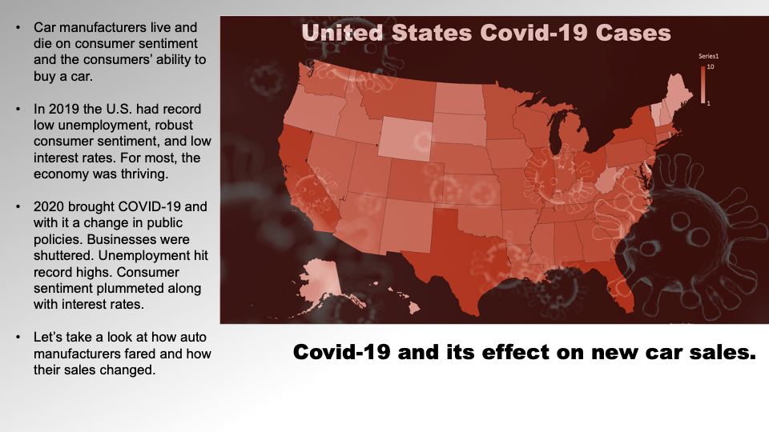
We’ll take a look at how COVID affected unemployment and interest rates and consumer sentiment.  We’ll explore how car sales changed in the Economy, Mid-Range, Luxury, and Ultra Luxury segments. Which brands were the biggest winners? …and the biggest losers?
 
How did auto sales and consumer sentiment drive the stock prices of the auto segment indexes? 

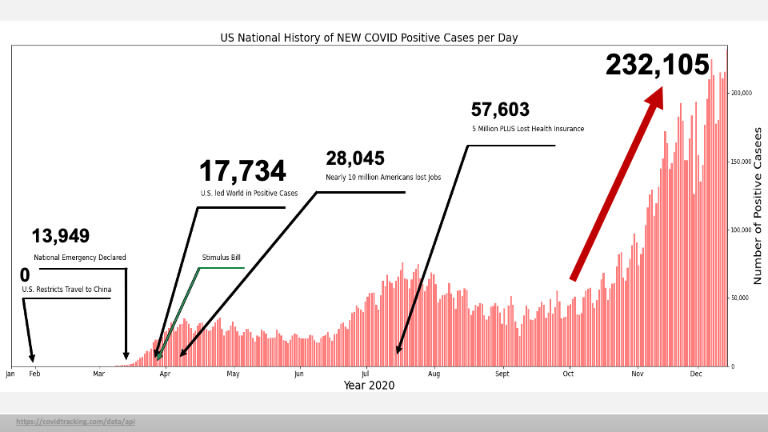
In this bar graph, we see the total amount of Covid Positive Cases Per Day within the United States. As it illustrates, the numbers have risen as the days have gone.
The Historical Markers represent a time when Our Nation has experienced an insurmountable event due to the effects of COVID -19. 

During the eve of the new year 2020, January becomes a significant month because the US restricts travel to China to prevent a deadly virus from spreading to our shores. This is the lowest point in the bar graph for 0 positive covid-19 cases for the U.S.
 
In March there were three significant events: 
The President declares a National Emergency, The U.S. led the world in confirmed cases with 17,734 positive covid-19 cases for the day, and Trump signed a stimulus bill into law.. 
In April - Millions lost their jobs …the question for many…Will I be able to afford food, rent, mortgage, the basic necessities, much less a car?  

The bar graph illustrates a roller coaster of positive increase cases per day…reaching a peak in mid April and July. At the end of September, there is an increase of cases per day for the U.S. leading to a subsequent spike (ADVANCE) of the last day recorded for this project – December 11, 2020, for the staggering number of one-day positive cases of 232,105.
 
And STILL have we reached a Peak?
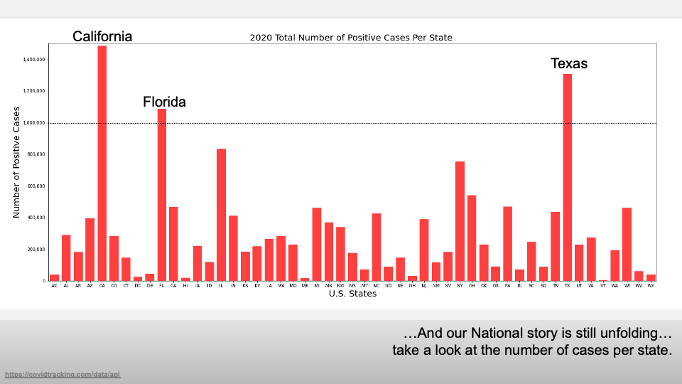
…And our National story is still unfolding…take a look at the number of cases per state. As you can see, Covid – 19 cases have overwhelmed the United States.
Such as the heavily populated states like California, Florida, and Texas, have surpassed the ONE Million mark for the year…and closely following are states like Illinois and New York. 

How has Covid affect the general indicators of the country?

We have selected three indicators that give us an idea of the general situation: Unemployment rate, Consumer sentiment about buying a car and interest rates. 
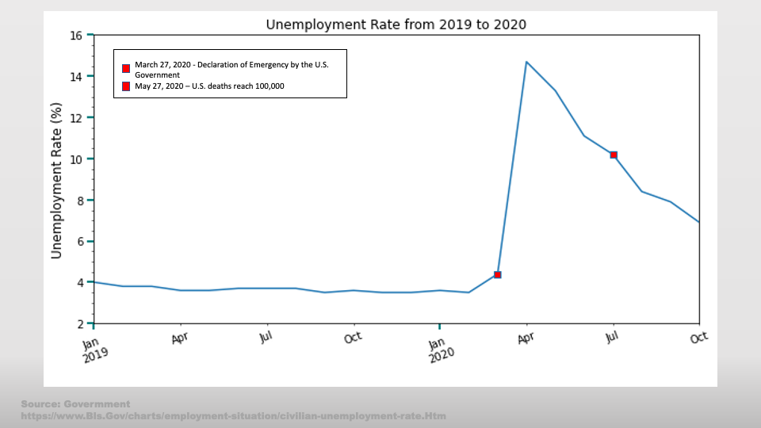
**Unemployment**

As we can see, in the year 2019 the unemployment rate was flat or decreasing, always under 4%. Then on early March, started to grow above 4% to go suddenly to almost 15% at the beginnings of April, mostly because the lockdowns and restrictions in major cities and counties and the drop in every activity in the life.  
 
The red dots marks two events that we consider very important in this time. the first one is the declaration of emergency of the US government on March 27th. The Second one is when the US reached the 100.000 deaths in May. 

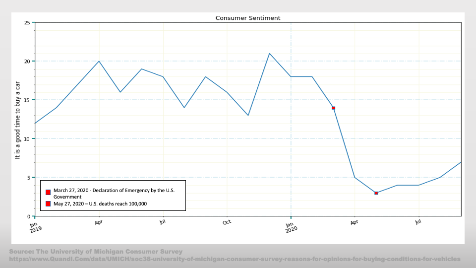
**Consumer sentiment**
The second indicator that we could use is the sentiment about buying a car

This data set is extracted from the University of Michigan Consumer Survey. The Surveys of Consumers are conducted by the Survey Research Center, under the direction of Richard T. Curtin, at the University of Michigan. 

The Surveys of Consumers have proven to be an accurate indicator of the future course of the national economy. 

The Survey give us many dataset that we can use. In this case we have chosen the value “Good Times, Times are good” 

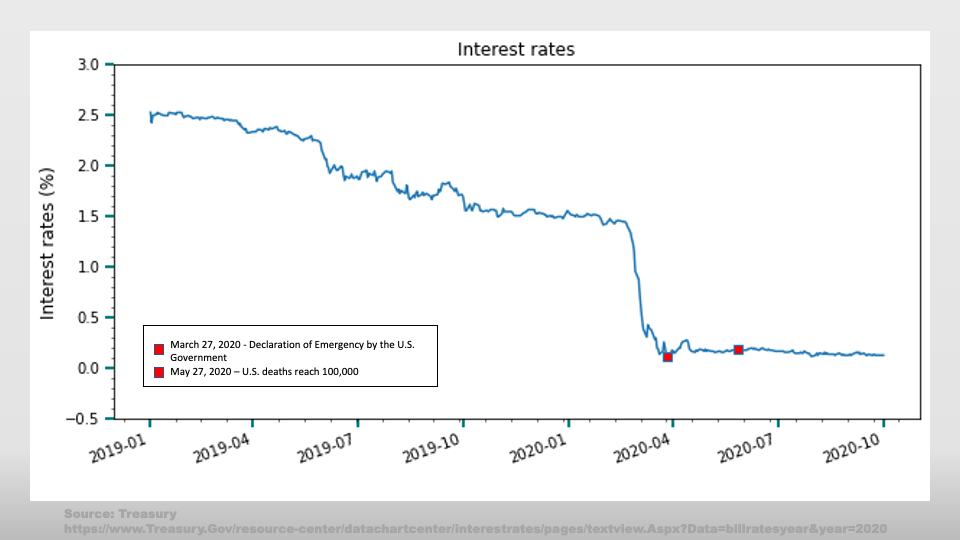
**Car and interest rates**

The third indicator, interest rates, is not an indicator or a value because it is an arbitrary number set by the Federal Reserve,  but it can be used as an indicator of what state the economy is in.  

The U.S. Congress established three key objectives for monetary policy in the Federal Reserve Act: maximizing employment, stabilizing prices, and moderating long-term interest rates. 

So, the Fed is an independent institution but works with the government to get it goals. The Fed's ability to increase and decrease interest rates is a tool used to keep the economy flowing. Usually when the interest rates drop, the demand rise... But, is that true in this case?

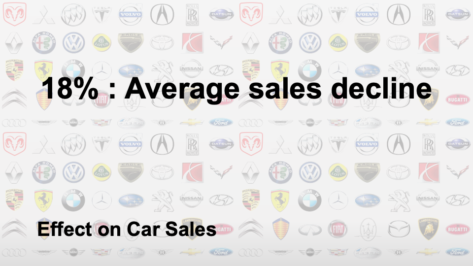
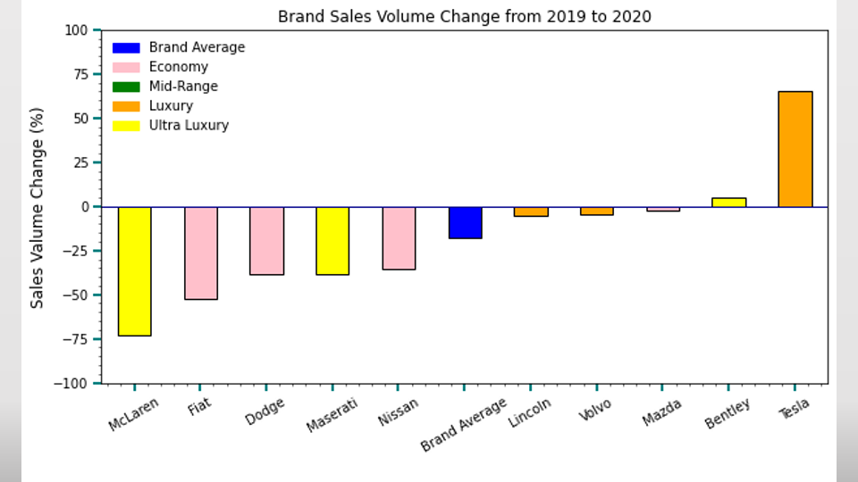
As you can see from the graph, the top 5 brands are Lincoln, Volvo, Mazda, Bentley, and Tesla  

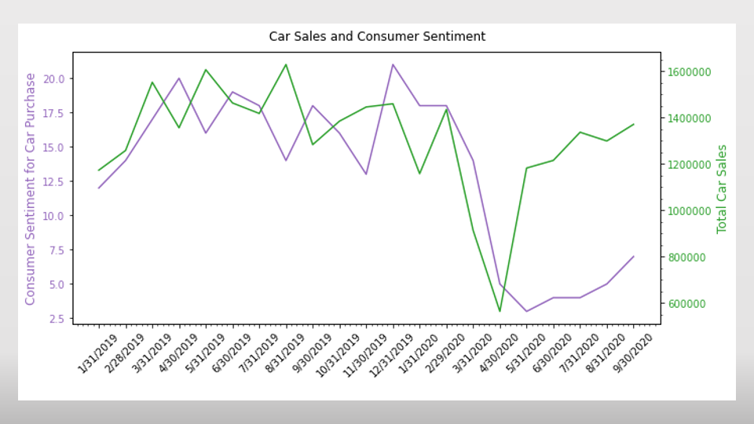

Moving along to consumer sentiment 

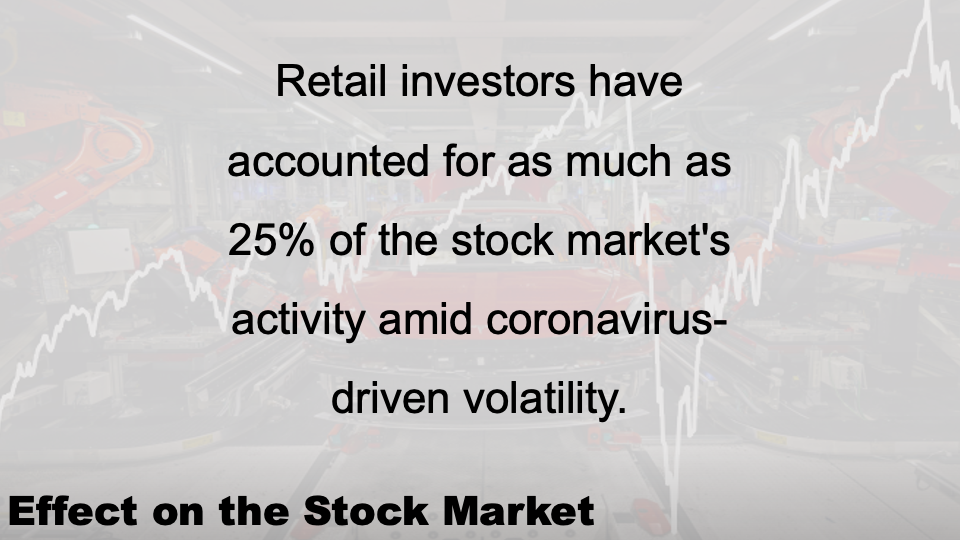
Effect on the Stock Market:
We’ve seen the trends for COVID, unemployment, interest rates, and consumer sentiment.  All are factors in stock market performance but we’re going to zero in on consumer sentiment.

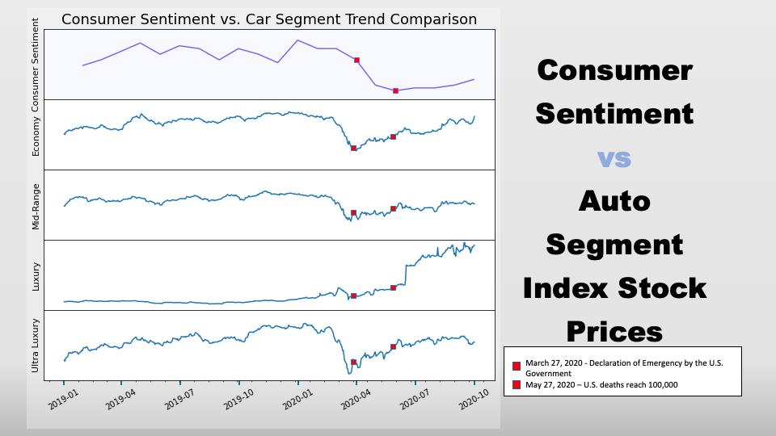
Effect on the Stock Market:
We’ve seen the trends for COVID, unemployment, interest rates, and consumer sentiment.  All are factors in stock market performance but we’re going to zero in on consumer sentiment.
 
Consumer Sentiment vs Auto Segment Index:
Consumer sentiment affects stock prices in two ways.  The consumers’ car purchases are a significant factor in the profit and loss of the manufacturers…and this is a key metric used by investors to value the company and its future prospects. 
 
Secondly the consumer is a retail stock investor. How they “feel” about a company determines whether they buy stock in it...
 
To more or less degree each of the auto group stock price indexes tracked consumer sentiment.  We’ve marked two significant events by red squares. The first is the signing of the stimulus package and the second is hitting 100,000 death milestone. 
 
While consumer sentiment continued a nosedive after the stimulus package was passed, the stock prices of each segment rallied…this implies that investor outlook had improved.  Fiscal and monetary policies would be deployed to support businesses.  Certainly, the SBA loan programs were probably relevant. It’s interesting that Economy and Ultra Luxury stock price trends have very similar shapes even though how economic factors affect these two types of car buyers couldn’t be more different. 
 
Mid-Range index has less volatility. These auto manufacturers represent the largest number of car sales. The Luxury Index is our outlier and we will circle back to it in a moment.

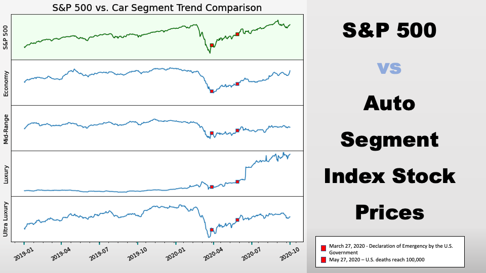
S&P 500 vs Auto Segment Index
In comparing the Auto Group segments we, unsurprisingly, make similar observations.  The implication is that consumers and how they feel, though only 25% of stock purchasers, influence prices. The greatest volatility and closest track are seen in the Ultra Luxury index. There’s an implication that the consumers of these cars are more heavily influenced by stock market performance and their willingness to sell stock and buy a McLaren or a Ferrari, in turn, is a factor in the stock price of the company.

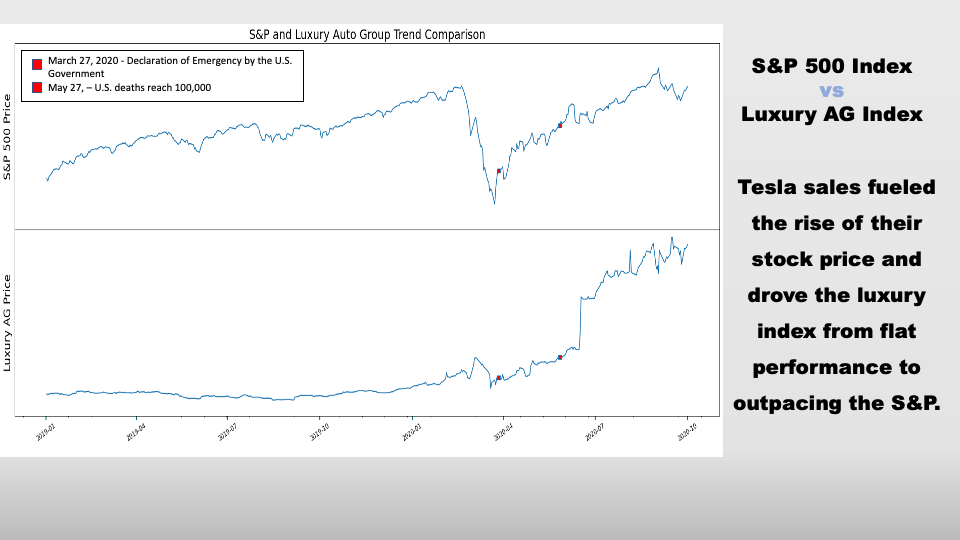
S&P Index vs Luxury Auto Group
Our outlier.  Initially it appears that luxury cars were oblivious to world chaos.  It turns out that only one of them was and was oblivious in a spectacular fashion. 
 
Tesla is selling electric cars as fast as they roll off the assembly line and their stock price is benefiting from the future prospects of the company. The stock had a curious price support…short sellers.  Short sellers “sold” Tesla stock they did not own betting that the price would go down. When it didn’t, they had to buy the stock at a higher price and have suffered $30 billion in losses in 2020. This behavior tends to drive prices up. [Some of this deleted if time is short]
Tesla’s stock value has increased tenfold in 2020 and this drove the luxury index from flat performance to outpacing the S&P. This has dominated the index and other broad economic factors (though a flattening in the slope is observed in April through June).

To better understand if COVID-19 has affected the U.S. Car Industry…let’s summarize the data
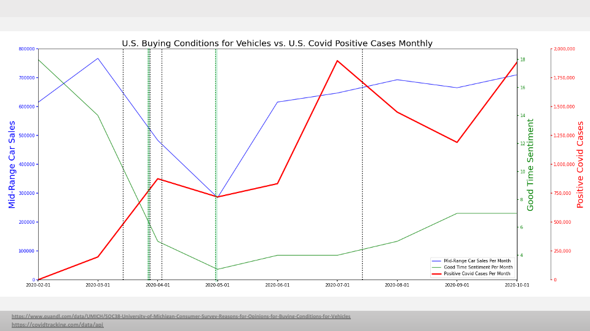
To better understand if COVID-19 has affected the U.S. Car Industry…let’s summarize the data.

 
This is a line graph illustrating three lines that show the U.S. Buying Conditions for Vehicles and Mid-Range Car Sales versus U.S. Covid-19 Positive Cases Per Month.

 
The dotted BLACK vertical lines represent negative historical markers: first-U.S. National Emergency Declaration, second - U.S. Leading the World in Positive Cases, third - more than 10 million Americans are unemployed, and fifth - More than five million Americans lost health insurance.

 
The dotted Green vertical lines represent positive historical markers: one - when the first Stimulus Bill was Signed and two - when Airlines announced rules requiring face masks.

 
To note, negative and positive historical markers could be considered as events that influenced consumer sentiment for buying vehicles.

 
Here…The red line, representing the monthly # of Covid Cases shows an upward trend with two major peaks in April and July.

 
The green line, representing the monthly Index of consumer sentiment for the buying conditions of vehicles, demonstrates a downward trend that shows a significant decrease from February to May and slightly less dramatic increase from May to October. The Index Calculations are derived from Surveys of Consumers taken by the University of Michigan and then calculated in a mathematical formula to come up with a score. Here we see a score per month.

 
The blue line represents the monthly Mid-Range Car Sales. In early March, began a fall in car sales for Mid-Range cars. Then a sharp increase from May to June. The line seems to increase a bit until August with a slight decrease until September.

 
There are two observations here that are evident and that these three lines appear to have some correlation. 

* As the RED Covid-19 line trend increases... Consumer Sentiment decreases without gaining back much of what it has lost from the original high point of 18. The U.S. Consumer sentiment for buying cars decreases because times are hard and money is tight due to the hardships instigated by COVID-19. This is a **Negative Correlation** of\
**-0.6677292147412445** and the negative number shows that the relationship between the two variables is that as one variable increases, the other decreases. It may not describe the cause but it shows an observable pattern.

* The second observation represented here is that the Blue Mid-Range car sales line seems to parallel with the Green Consumer Sentiment line for the best time to buy a car. It shows that both decrease and increase at the same points in time. This has a **Weak Positive Correlation** value of\ 
**0.4062742191517205**
 
And so it appears that the Nationally Historic events due to COVID-19, shows a pattern that leans towards affecting the current situation of Consumer Sentiment for Buying Vehicles such as Mid-Range Cars. …

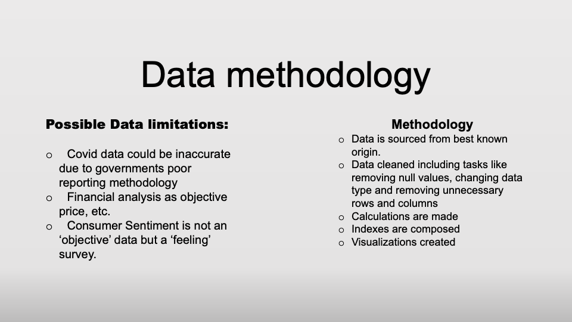

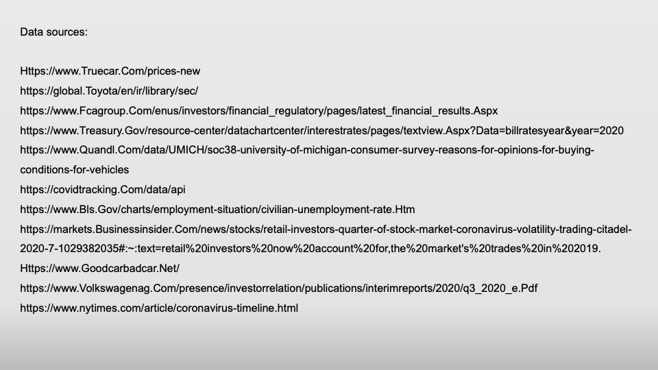