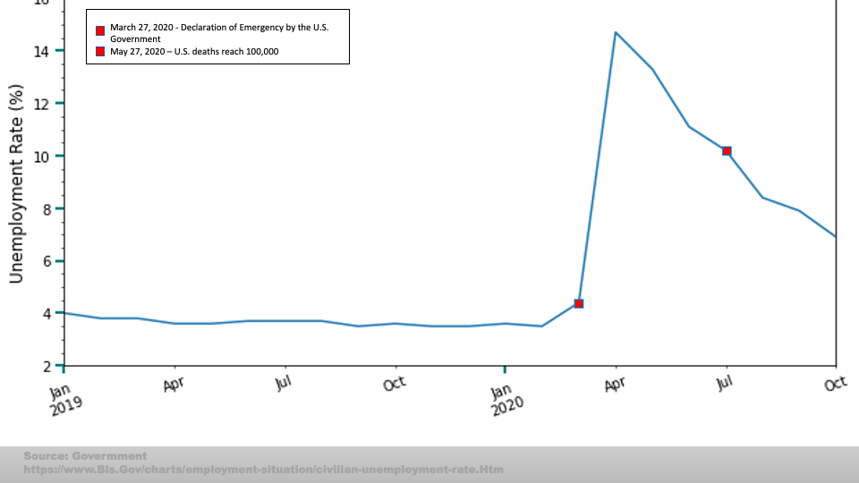

# How did Covid-19 affect the U.S. car buying industry in 2020?

##### *TEAM 6: Karen Pearson, Luis Fernando Ruiz, Phillecia Qualls, Dana Woodruff*

**Project Hypothesis**
  COVID trend, Interest rate trend, Unemployment trend, and Consumer Sentiment trend were each visualized to easily observe which factors explain the change in consumer behavior towards car sales. Covid-19 is the precipitating event that influenced each factor. It's effect is examined in the following plots.

* Observed impact of covid-19 in the United States along with historical markers.

* Total car sales trend was compared to the Consumer Sentiment trendline.

* The team observed the best and worst performances of the targeted forty auto brands car sales from 2019 and 2020.

* The team created weighted average indexes of the targeted twenty-one auto groups to compare to overall S&P 500 performance and to one another pre- and post- COVID.  The four indexes' performance differed from one another and from the S&P 500.

* The indexes were compared to the Consumer Sentiment trendline.

Final Powerpoint presentation:

We’ll take a look at how COVID affected unemployment and interest rates and consumer sentiment.  We’ll explore how car sales changed in the Economy, Mid-Range, Luxury, and Ultra Luxury segments. Which brands were the biggest winners? …and the biggest losers?
 
How did auto sales and consumer sentiment drive the stock prices of the auto segment indexes? 

In this bar graph, we see the total amount of Covid Positive Cases Per Day within the United States. As it illustrates, the numbers have risen as the days have gone.
The Historical Markers represent a time when Our Nation has experienced an insurmountable event due to the effects of COVID -19. 

During the eve of the new year 2020, January becomes a significant month because the US restricts travel to China to prevent a deadly virus from spreading to our shores. This is the lowest point in the bar graph for 0 positive covid-19 cases for the U.S.
 
In March there were three significant events: 
The President declares a National Emergency, The U.S. led the world in confirmed cases with 17,734 positive covid-19 cases for the day, and Trump signed a stimulus bill into law.. 
In April - Millions lost their jobs …the question for many…Will I be able to afford food, rent, mortgage, the basic necessities, much less a car?  

The bar graph illustrates a roller coaster of positive increase cases per day…reaching a peak in mid April and July. At the end of September, there is an increase of cases per day for the U.S. leading to a subsequent spike (ADVANCE) of the last day recorded for this project – December 11, 2020, for the staggering number of one-day positive cases of 232,105.
 
And STILL have we reached a Peak?

