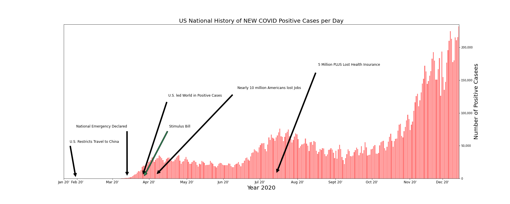
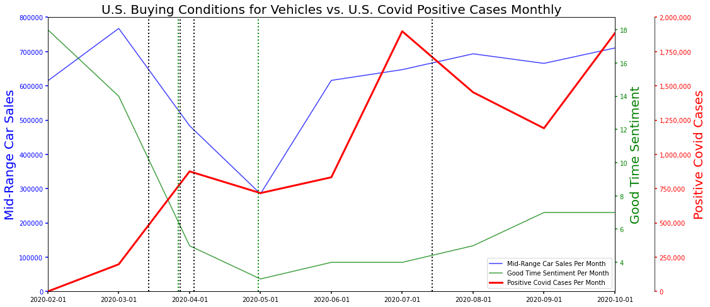

# How did Covid-19 affect the U.S. car buying industry in 2020?

##### *TEAM 6: Karen Pearson, Luis Fernando Ruiz, Phillecia Qualls, Dana Woodruff*

**Project Hypothesis**
• COVID trend, Interest rate trend, Unemployment trend, and Consumer Sentiment trend were each visualized to easily observe which factors explain the change in consumer behavior towards car sales. Covid-19 is the precipitating event that influenced each factor. It's effect is examined in the following plots.

Final Powerpoint presentation 

* Observed impact of covid-19 in the United States along with historical markers.

* Total car sales trend was compared to the Consumer Sentiment trendline.

  
* The team observed the best and worst performances of the targeted forty auto brands car sales from 2019 and 2020.

  
* The team created weighted average indexes of the targeted twenty-one auto groups to compare to overall S&P 500 performance and to one another pre- and post- COVID.  The four indexes' performance differed from one another and from the S&P 500.

* The indexes were compared to the Consumer Sentiment trendline.

   
Resources:
•	https://www.truecar.com/prices-new
•	https://www.goodcarbadcar.net/
•	https://global.toyota/en/ir/library/sec/
•	https://www.fcagroup.com/enUS/investors/financial_regulatory/Pages/latest_financial_results.aspx
•	https://www.treasury.gov/resource-center/datachartcenter/interestrates/Pages/TextView.aspx?data=billRatesYear&year=2020
•	https://www.quandl.com/data/UMICH/SOC38-University-of-Michigan-Consumer-Survey-Reasons-for-Opinions-for-Buying-Conditions-for-Vehicles
•	https://covidtracking.com/data/api
•	https://www.bls.gov/charts/employment-situation/civilian-unemployment-rate.htm
•	https://www.volkswagenag.com/presence/investorrelation/publications/interimreports/2020/Q3_2020_e.pdf
•	https://www.yahoofinance.com

